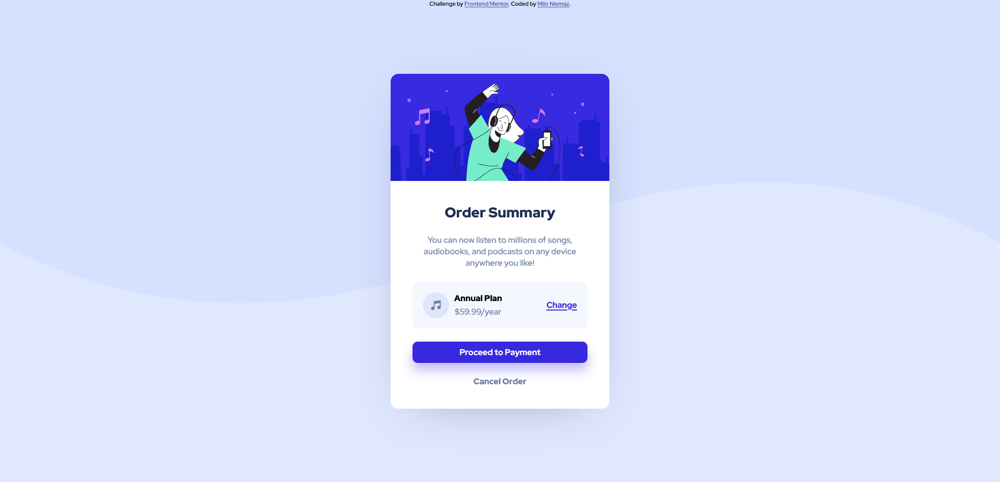

# Frontend Mentor - Order summary card solution

This is a solution to the [Order summary card challenge on Frontend Mentor](https://www.frontendmentor.io/challenges/order-summary-component-QlPmajDUj). Frontend Mentor challenges help you improve your coding skills by building realistic projects. 

## Table of contents

- [Overview](#overview)
  - [The challenge](#the-challenge)
  - [Screenshot](#screenshot)
  - [Links](#links)
- [My process](#my-process)
  - [Built with](#built-with)
  - [What I learned](#what-i-learned)
  - [Continued development](#continued-development)
  - [Useful resources](#useful-resources)
- [Author](#author)
- [Acknowledgments](#acknowledgments)

## Overview

### Screenshot




### Links

- Solution URL: [My solution](https://polec4t.github.io/challenge-2-order_summary/)

## My process

### Built with

- Semantic HTML5 markup
- CSS custom properties
- Flexbox
- position absolute

### What I learned

That was the first time I maked a responsive page this way, It is nice.

```css
@media screen and (max-width: 460px) {
  /* ... */
}
```

## Author

- Frontend Mentor - [@POLEC4T](https://www.frontendmentor.io/profile/POLEC4T)

